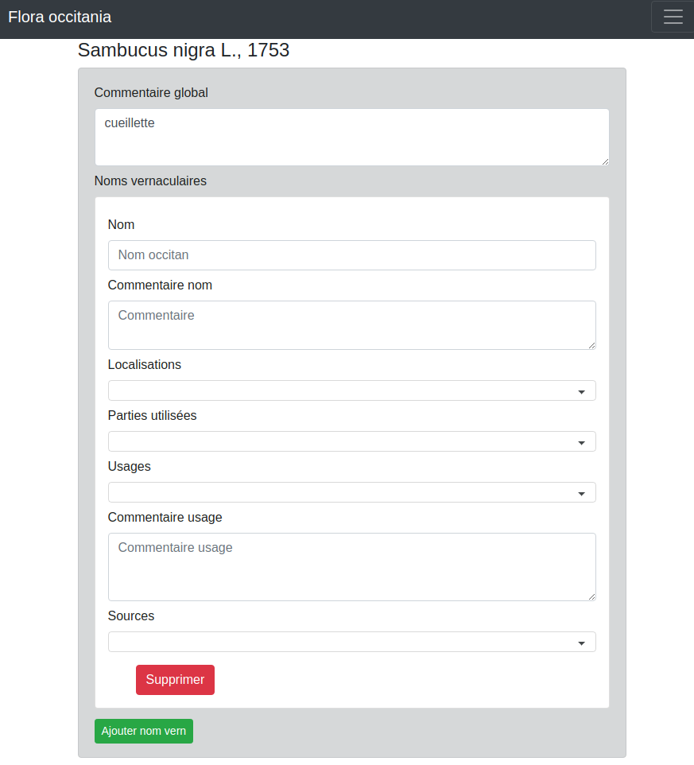

# floraOccitania
Sasie des noms vernaculaire en occitan et de données ethnobotanique


### Captures d'écrans




## Installation 
### Prerequis
* apache 
* supervisorctl

### nodejs et angular
```
curl -sL https://deb.nodesource.com/setup_10.x | sudo -E bash -
sudo apt-get install -y nodejs

sudo npm install -g @angular/cli
```
### Configuration apache2
```
Alias /flora_occitania /APP_DIR/floraOccitania/frontend/flora-occitania/dist
<Directory /APP_DIR/floraOccitania/frontend/flora-occitania/dist>
    Options Indexes FollowSymLinks MultiViews
    AllowOverride All
    Require all granted
</Directory>
```
### Build application
```
ng build --prod --base-href /flora_occitania/
```
